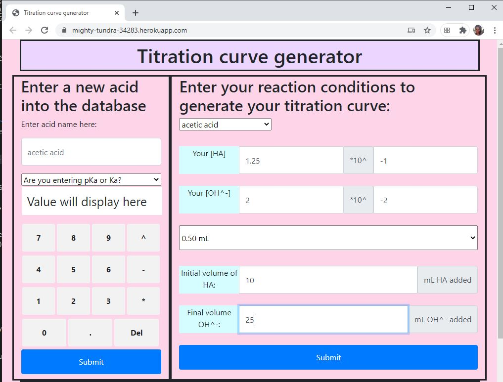
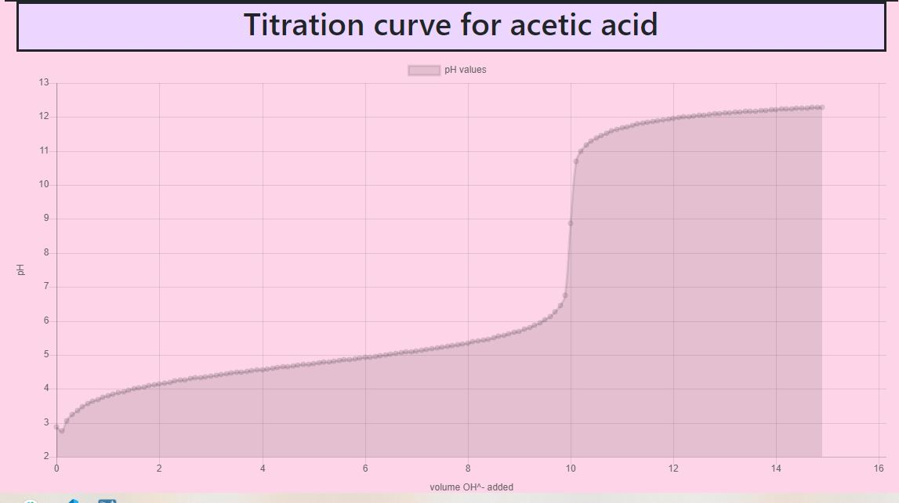
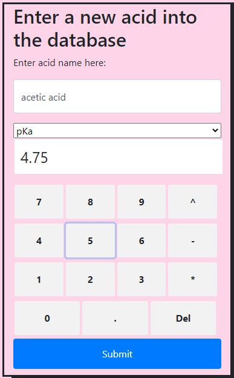

# titrationCurve 

# Table of contents
1. [Description](#Description)
2. [Installation instructions](#Installation-instructions)
3. [Usage](#usage)
4. [Contributions](#Contributions)
5. [Testing instructions](#Testing-instructions)
6. [License](#License)
7. [Questions](#Questions)

## Description: 
A student, teacher, or researcher can generate what certain titration curves will look like under various conditions. Users also create a database of common acids.

This application is deployed in <a href='https://mighty-tundra-34283.herokuapp.com/'>heroku.</a>   

A user can select from acids already in the database and set reaction conditions for their titration. 

This generates the titration curve:

If the acid is not already in the database, the user can enter it in themselves either as pKa or Ka:

## Installation instructions: 
Express, mysql, charts.js are required to run this program.

## Usage: 
This is geared towards chemistry teachers who want to be able to easily generate titration curves to use in practice problems.

## Contributions: 
This is currently a solo project for skolnikskolnik.

## Testing instructions: 
Generate a titration curve and see what it looks like. This does require that the user has a strong chemistry background.

## License:  
This project is covered under the MIT License license.

## Questions
Visit my <a href='https://www.github.com/skolnikskolnik'>github page.</a> 

Email me at jtskolnik@gmail.com with any additional questions you may have. I am always happy to talk to users of my product!
    